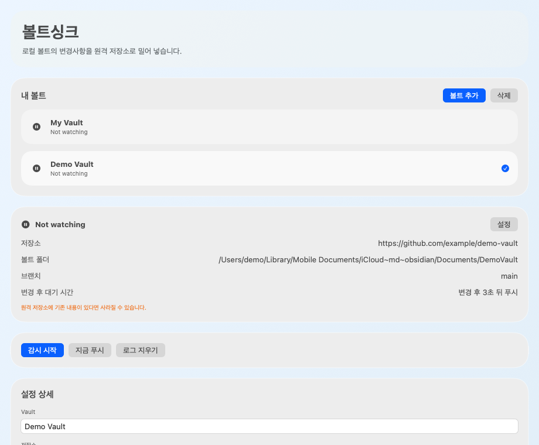

# VaultSync

VaultSync is a macOS menu bar app for people who keep their Obsidian vault in iCloud Drive, but also want that same vault pushed to Git.

iCloud Drive is convenient for using Obsidian across Apple devices, but it is not the same thing as keeping a Git history or pushing to GitHub. VaultSync fills that gap: it watches your local vault folder, creates commits when files change, and pushes those changes to a remote Git repository.

## Who This Is For

VaultSync is mainly for this setup:

- You use Obsidian
- Your vault lives inside iCloud Drive
- You want GitHub or another Git remote as an additional backup or sync target
- You do not want to manually run `git add`, `git commit`, and `git push` every time

## What VaultSync Does

- Watches a local vault folder on macOS
- Waits briefly after file changes settle
- Creates a Git commit for local changes
- Pushes that commit to your remote repository
- Runs as a lightweight menu bar app

VaultSync uses a real hidden `git worktree` setup internally, so your Obsidian vault can stay where it already is, including inside iCloud Drive.

## Why Not Just Use Git Inside The Vault Folder?

You can, but many people prefer not to directly manage a full visible Git repository inside an iCloud-synced Obsidian folder.

VaultSync keeps the hidden base repository separately under:

`~/Library/Application Support/VaultSync/Repos/<target-id>.git`

Then it links your vault folder to that hidden repository through a real `git worktree`.

This keeps the Git plumbing managed by the app while letting you continue to use the vault folder normally in Obsidian and iCloud Drive.

## Screenshot



## Features

- macOS menu bar app
- Compact popover for quick status checks
- Separate setup window for onboarding
- Real `git worktree`-based internal repository management
- One-way local-to-remote push flow
- File change detection using macOS file system events
- Optional force push with an explicit warning
- Korean and English UI based on the system language

## How It Works

When files inside your vault change, VaultSync:

1. Detects the file system change
2. Waits a short time so multiple edits can settle
3. Creates a local commit if something changed
4. Pushes the current branch to the configured remote repository

If `Allow remote overwrite` is enabled, VaultSync may use force push. That means files already present in the remote repository can be replaced by your local vault state.

## Typical Use Case

1. Store your Obsidian vault in iCloud Drive
2. Open VaultSync
3. Add a vault
4. Select your Obsidian vault folder
5. Enter your Git remote URL
6. Let VaultSync watch the folder and push local changes automatically

This gives you:

- iCloud Drive for Apple-device sync
- GitHub or another Git remote for version history and backup

## Build

Requirements:

- macOS
- Xcode 16 or newer

Build from Xcode:

1. Open `GitSync.xcodeproj`
2. Select the `GitSync` target
3. Set your signing team if needed
4. Build and run

Build from the command line:

```bash
xcodebuild \
  -project GitSync.xcodeproj \
  -scheme GitSync \
  -configuration Debug \
  -derivedDataPath /tmp/GitSyncDerivedData \
  CODE_SIGNING_ALLOWED=NO \
  build
```

## Usage

1. Launch the app
2. Click the menu bar icon
3. Press `Add Vault`
4. Choose your Obsidian vault folder in iCloud Drive or anywhere else on your Mac
5. Enter the remote repository URL
6. Decide whether remote overwrite should be allowed
7. Finish setup

After setup, VaultSync keeps watching the vault folder and pushing local changes to Git.

## Privacy

- Personal default paths and personal remote URLs are not hardcoded
- Per-user Xcode workspace data is ignored via `.gitignore`
- The hidden Git base repository is stored in the current macOS user's Application Support directory

## Third-Party Software

- `git-sync` by Simon Thum and contributors
  - Source: <https://github.com/simonthum/git-sync>
  - License: CC0

## License

This project is licensed under the MIT License.

See [LICENSE](LICENSE) for the full text.
